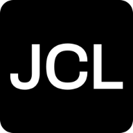

<div id="top"></div>

<!-- PROJECT LOGO -->
<br />
<div align="center">
  <a href="https://github.com/othneildrew/Best-README-Template">
    
  </a>

  <h3 align="center">Juan Cruz Lambrechts's Portfolio</h3>

  <p align="center">
    My personal portfolio showcasing my blog and projects!
    <br />
    <a href="https://github.com/CatBoxy/personal-portfolio"><strong>Explore the docs »</strong></a>
  </p>
</div>

<!-- TABLE OF CONTENTS -->
<details>
  <summary>Table of Contents</summary>
  <ol>
    <li>
      <a href="#about-the-project">About The Project</a>
      <ul>
        <li><a href="#built-with">Built With</a></li>
      </ul>
    </li>
    <li>
      <a href="#getting-started">Getting Started</a>
      <ul>
        <li><a href="#prerequisites">Prerequisites</a></li>
        <li><a href="#installation">Installation</a></li>
      </ul>
    </li>
    <li><a href="#roadmap">Roadmap</a></li>
    <li><a href="#contact">Contact</a></li>
    <li><a href="#acknowledgments">Acknowledgments</a></li>
  </ol>
</details>


<!-- ABOUT THE PROJECT -->
## About The Project

This is the website I built to showcase every project I get my hands on, and my personal blog where I document my learning and thoughts.

<p align="right">(<a href="#top">back to top</a>)</p>


### Built With

* [Next.js](https://nextjs.org/)
* [React.js](https://reactjs.org/)
* [tailwindcss](https://tailwindcss.com/)
* [contentlayer](https://www.contentlayer.dev/)
* [Framer motion](https://www.framer.com/motion/)

<p align="right">(<a href="#top">back to top</a>)</p>


<!-- GETTING STARTED -->
## Getting Started

### Prerequisites

To clone and run this application, you'll need Git and Node.js (which comes with npm) installed on your computer.

### Installation

From your command line:

1. Clone this repository
```sh
 git clone https://github.com/CatBoxy/personal-portfolio.git
```

2. Go into the repository
```sh
 cd personal-portfolio
```

3. Install dependencies
```sh
 npm install
```
4. Run locally

```sh
npm run dev
# or
yarn dev
```

<p align="right">(<a href="#top">back to top</a>)</p>

<!-- ROADMAP -->
## Roadmap

- [x] Add Works view
- [x] Add Blog view
- [x] Dark theme
- [x] Add first blog post
- [x] Add download CV button
- [ ] Multi-language Support
    - [ ] English
- [ ] Add custom components view
- [ ] SEO optimization

<p align="right">(<a href="#top">back to top</a>)</p>


<!-- CONTACT -->
## Contact

Juan Cruz Lambrechts - juancruzlambrechts@gmail.com 

[](https://www.linkedin.com/in/jclambrechts/)

Project Link: [https://personal-portfolio-catboxy.vercel.app/](https://personal-portfolio-catboxy.vercel.app/)

<p align="right">(<a href="#top">back to top</a>)</p>


<!-- ACKNOWLEDGMENTS -->
## Acknowledgments

Resources and projects I found useful when building this website.

* [leerob](https://github.com/leerob/leerob.io)
* [craftzdog](https://github.com/craftzdog/craftzdog-homepage)
* [Readme template](https://github.com/othneildrew/Best-README-Template)
* [nextjs+mdx](https://github.com/hunterbecton/next-js-mdx)
* [React Icons](https://react-icons.github.io/react-icons/search)

<p align="right">(<a href="#top">back to top</a>)</p>
